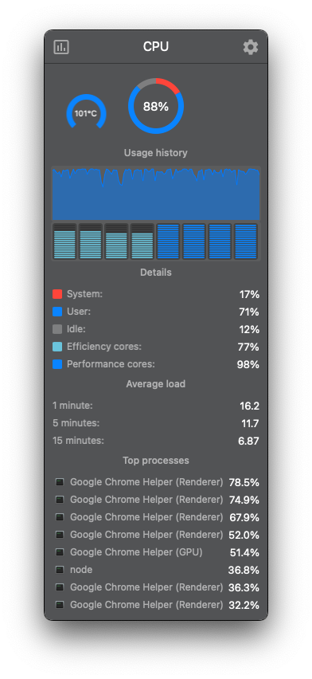
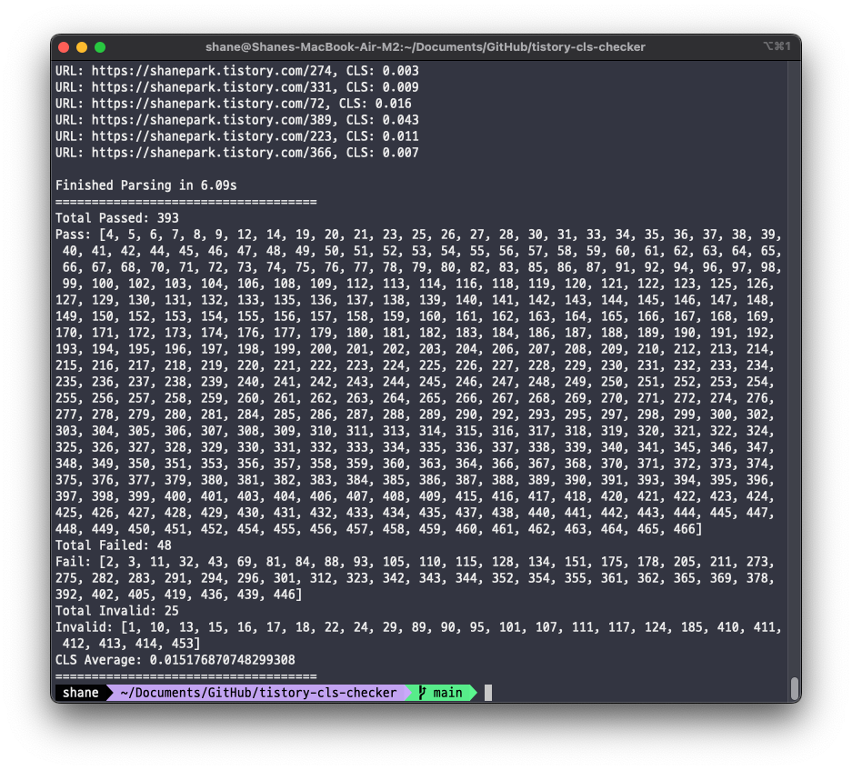

# Tistory blog CLS Checker

## Intro

If you have your own blog, you may have experienced CLS (Cumulative Layout Shift) problem.  
So I made this tool to check CLS of your blog posts.

Find out which posts have a bad CLS and fix them.

## Instructions

### 1. Make reports

There are two ways to make reports. choose one of them as you like.  
There are two arguments for each script.

- the first is the URL of your blog
- the second is maximum number of posts to check. It will check all from 1 to the number you set.

**Sequential**

> it's slower but does not stress the server.  
> If you need to check all metrics, it's recommended
>
Run

```bash
npm install -g lighthouse
chmod +x lighthouse_batch.sh
# ex) ./lighthouse_batch.sh https://shanepark.tistory.com 466
./lighthouse_batch.sh <your blog url> <max number of posts>
```

**Parallel**

> it's faster, but maybe affect server performance.  
> if you only need to check CLS, it's recommended

Run

```bash
npm install -g lighthouse
chmod +x lighthouse_batch_parallel.sh
# ex) ./lighthouse_batch_parallel.sh https://shanepark.tistory.com 466
./lighthouse_batch_parallel.sh <your blog url> <max number of posts>
```



> On my MacBook Air M2 (24GB) when I run it in parallel, it exceeds 101 degrees Celsius and throttles quickly.

### 2. check results

After making reports, you can check the results.  
Running this command will generate a list of bad CLS posts.

```bash
# Build
./gradlew clean shadowJar

# Run
java -jar build/libs/tistory-cls-checker-1.0-SNAPSHOT-all.jar \
  --input=./results \
  --output=./bad-cls-list \
  --cls=0.03
```

### 3. Your turn



It prints Passed, failed, and also invalid ( Deleted or hidden) postings list.

Also CLS Average is provided so you can determine your next step.

>  Tip: fix your image size, avoid using web fonts
